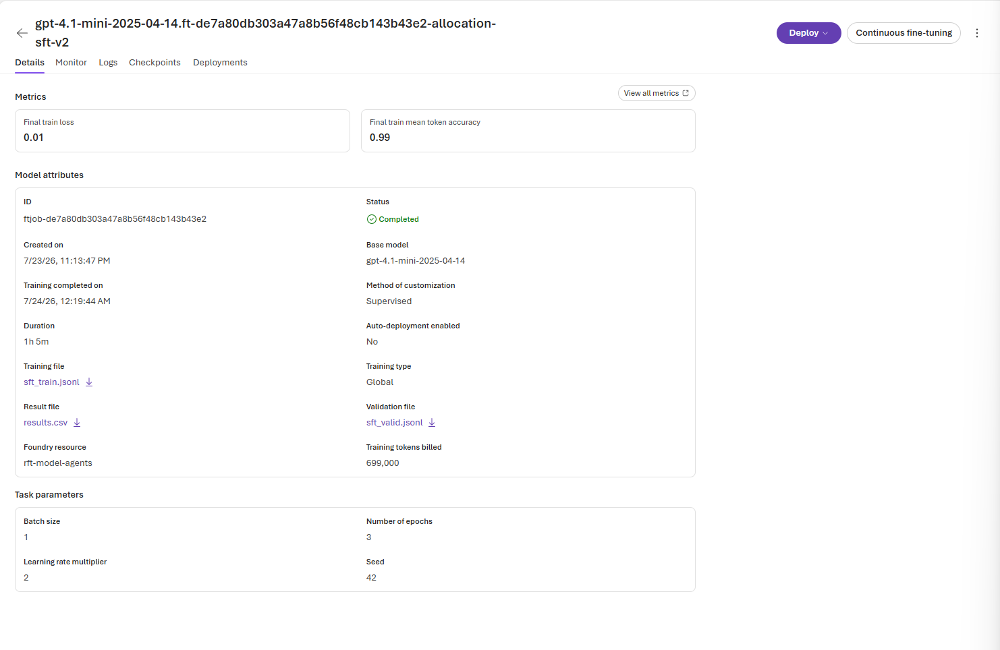
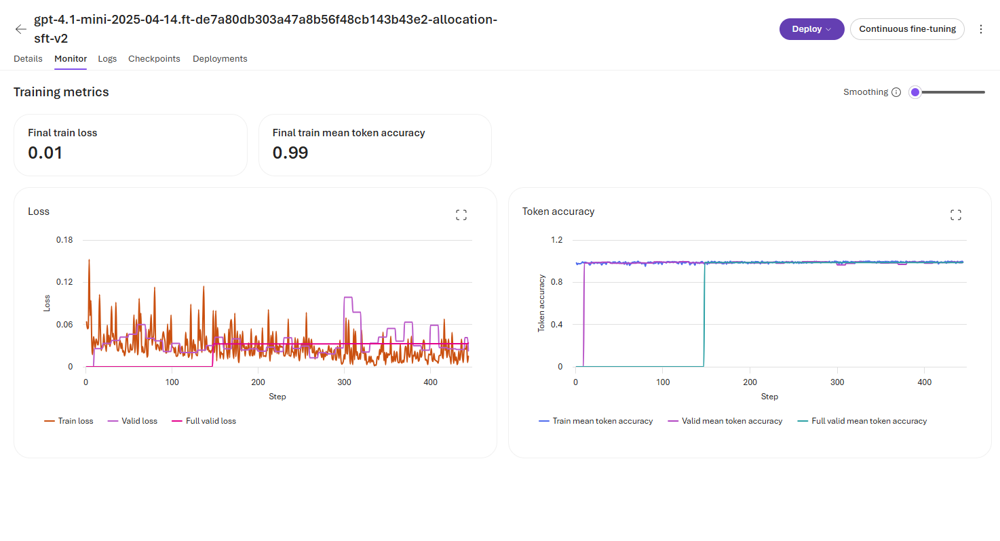
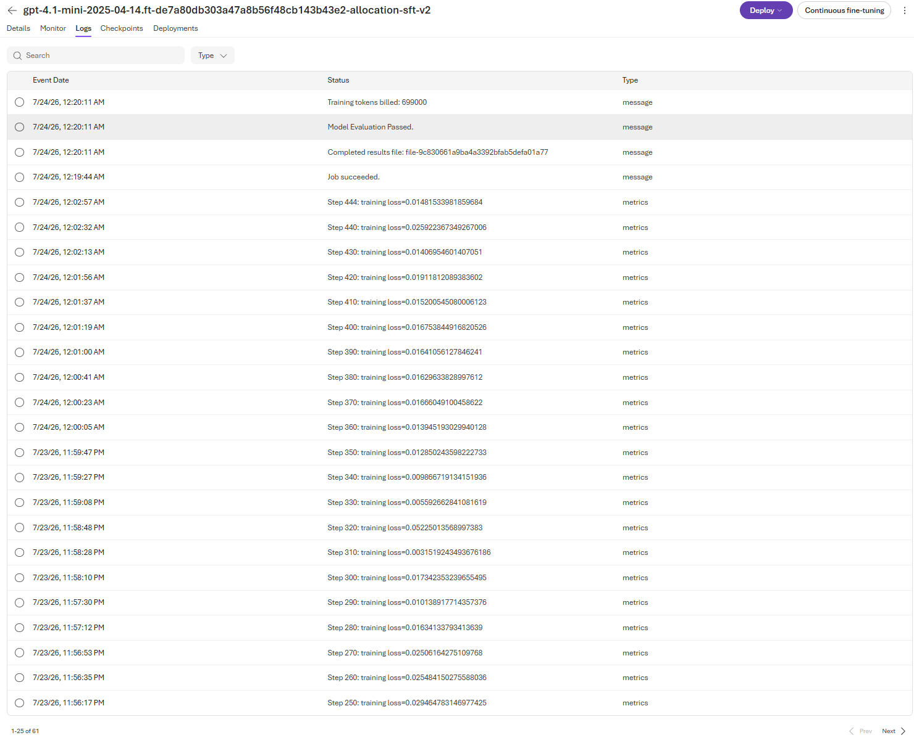
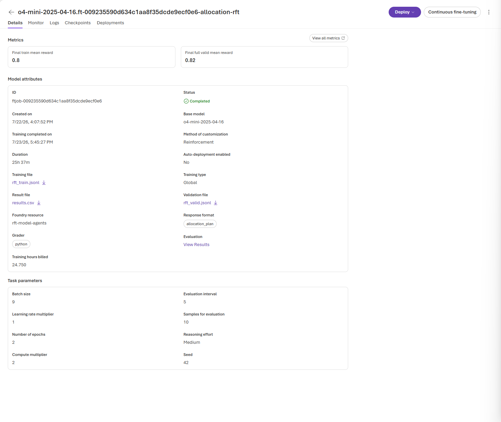
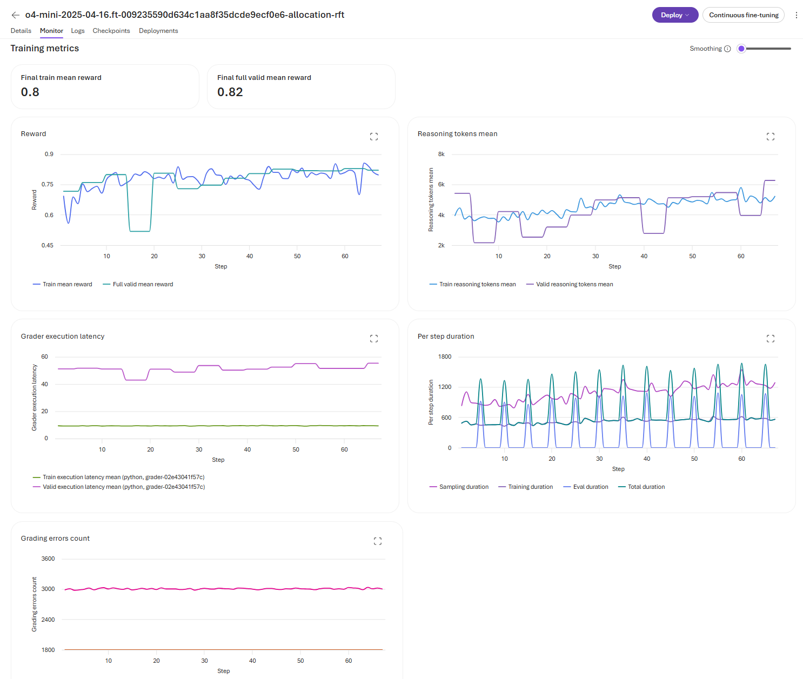
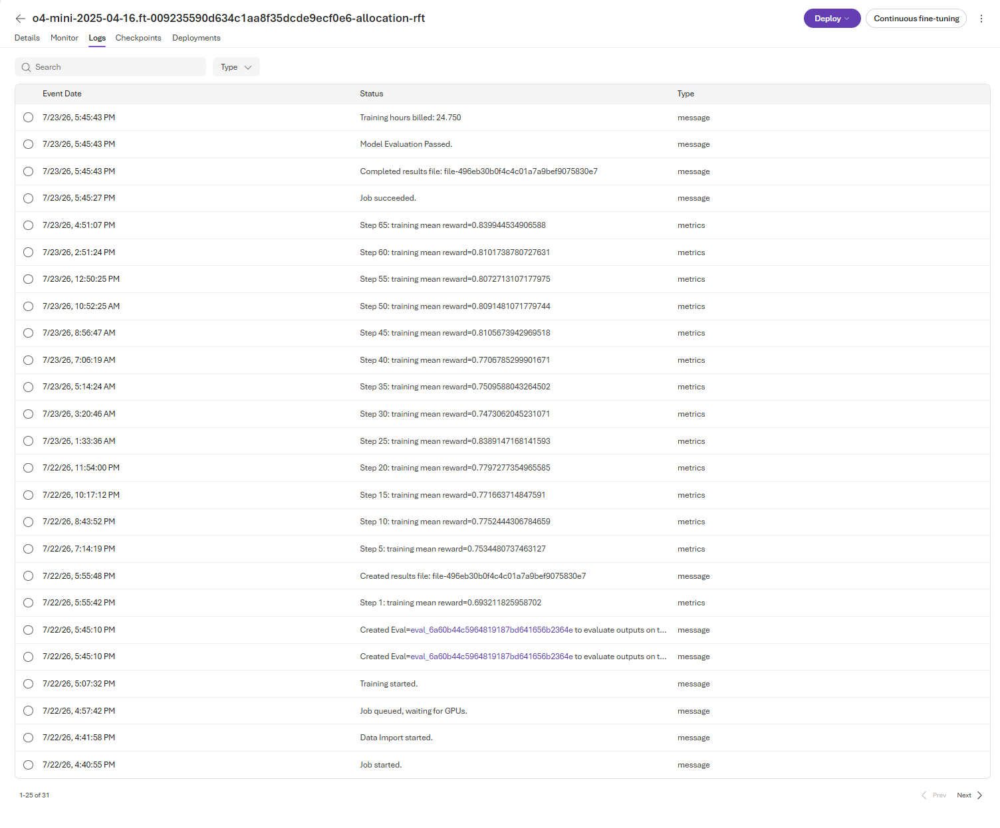

# Fine-Tuning

This stage submits separate supervised fine-tuning (SFT) and reinforcement fine-tuning (RFT) jobs to Azure AI Foundry, waits for completion, and deploys the resulting models for evaluation.

The repository does not train model weights locally. It validates artifacts, uploads datasets, creates managed fine-tuning jobs, polls their status, and deploys completed model IDs.

## Why The Experiment Uses Different Models

At the time this sample was written, Microsoft Foundry did not expose the required teacher inference, supervised fine-tuning, reinforcement fine-tuning, and raw-model deployment capabilities on one common model. The experiment therefore uses the models available for each role:

| Role | Model used | Reason |
|---|---|---|
| Teacher | `gpt-5.2` | Strong inference model used to generate candidate plans and SFT labels |
| SFT | `gpt-4.1-mini` | Model supported for supervised fine-tuning |
| RFT | `o4-mini` | Reasoning model supported for reinforcement fine-tuning with a grader |

This is a comparison of the available **model-and-training-method packages**, not a controlled comparison of SFT versus RFT on the same base model. Any measured difference may reflect both the training method and the underlying model. In addition, raw `o4-mini` could not be deployed because it was deprecated, so this sample cannot measure RFT uplift against its own untuned checkpoint.

These choices describe the recorded experiment. Deployment names remain configurable for future runs, and Foundry support should be rechecked before repeating the experiment.

## Stage Flow

```text
Dataset JSONL -> Local safety checks -> Upload files -> Submit Foundry job
              -> Managed training/validation -> Fine-tuned model ID
              -> Azure deployment -> Held-out evaluation
```

## Files

| File | Purpose |
|---|---|
| [sft/submit_sft_job.py](sft/submit_sft_job.py) | Upload SFT data and submit the supervised job |
| [rft/build_grader.py](rft/build_grader.py) | Package the deterministic scorer as a Foundry Python grader |
| [rft/grader.json](rft/grader.json) | Grader definition sent with the RFT request |
| [rft/submit_rft_job.py](rft/submit_rft_job.py) | Validate local RFT inputs, upload data, and submit the reinforcement job |
| [deploy_finetuned_model.py](deploy_finetuned_model.py) | Deploy a completed fine-tuned model ID to the Azure AI account |
| [redeploy_cross_subscription.py](redeploy_cross_subscription.py) | Redeploy an already fine-tuned model into a different subscription, resource group, or account |
| [common/fine_tuning_api.py](../common/fine_tuning_api.py) | Shared upload, submission, duplicate-job check, and polling client |

## Before Submission

Both submission scripts require:

- A passing [pilot gate](../01_baseline_teacher/traces/pilot_gate.json).
- An explicit `--confirm-paid` flag.
- Microsoft Entra authentication through `DefaultAzureCredential`.
- `AZURE_OPENAI_ENDPOINT` and the method-specific values in [.env.example](../.env.example).
- No active job with the same model, suffix, and fine-tuning method.

### Why RFT Has A Pre-Submit Audit

RFT optimizes the reward returned by the grader. A job can therefore complete successfully while learning the wrong behavior if the grader is stale, the prompt and scenarios disagree, data splits overlap, or the reward has too little useful variation. Because training is managed and billable, these mistakes should be rejected before any files are uploaded or a job is created.

[pre_submit_audit.py](../scripts/validation/pre_submit_audit.py) validates the local inputs to the RFT request:

- **Datasets:** exact row structure and counts, unique scenario IDs, and no overlap among training, validation, and final evaluation scenarios.
- **Prompt alignment:** each model-visible scenario matches the structured scenario supplied privately to the grader.
- **Grader freshness:** [grader.json](rft/grader.json) exactly matches the current [common/scoring.py](../common/scoring.py) implementation.
- **Reward integrity:** invalid and all-defer plans score zero, a reference plan remains feasible, and feasible teacher plans provide a sufficiently varied reward signal.
- **Experiment controls:** the intended model and frozen first-run RFT hyperparameters are unchanged.
- **Reproducibility:** the report prints hashes of the train file, validation file, and grader that were checked.

This is a local fail-fast check, not part of Foundry's training loop and not an audit of the model produced afterward. [submit_rft_job.py](rft/submit_rft_job.py) invokes it automatically before creating the client or uploading `rft_train.jsonl` and `rft_valid.jsonl`.

## SFT Job

SFT trains `gpt-4.1-mini` by default from teacher demonstrations:

- `sft_train.jsonl` contains the scenario plus the selected teacher plan as the assistant target.
- `sft_valid.jsonl` measures managed validation performance and does not update weights.
- The default job uses three epochs, seed `42`, and `GlobalStandard` training.

[submit_sft_job.py](sft/submit_sft_job.py) uploads both files and places their returned IDs in `training_file` and `validation_file`. Foundry then runs the supervised training and validation loops.

```powershell
.\.venv\Scripts\python.exe 03_finetuning/sft/submit_sft_job.py --confirm-paid
```

### Observed SFT Run

The captured Foundry run completed successfully and produced a fine-tuned model. The screenshots are retained in [sft/output](sft/output/).

| Outcome | Observed value |
|---|---:|
| Base model | `gpt-4.1-mini-2025-04-14` |
| Training rows | 148 |
| Validation rows | 38 |
| Epochs | 3 |
| Foundry-selected batch size | 1 |
| Training steps | 444 |
| Final training loss | 0.01 |
| Final validation loss | 0.01 |
| Final training mean token accuracy | 0.99 |
| Final validation mean token accuracy | 0.99 |
| Billed training tokens | 699,000 |
| Status | Completed | 



*Foundry job results: the run completed with low final training and validation loss and high token accuracy on both splits. Foundry billed 699,000 training tokens.*

The step count is fully explained by the submitted data and the batch size selected by Foundry:

$$
\frac{148\text{ rows}\times3\text{ epochs}}{1\text{ row per batch}}=444\text{ training steps}
$$

The 699,000 billed tokens correspond to approximately 1,574 tokens per row exposure across those 444 steps. This is an accounting average, not a claim that every row has the same token length.



*Foundry job details: the managed run used the uploaded 148-row training file, 38-row validation file, three epochs, and a service-selected batch size of one.*

**Recorded timeline**

| Event | Time |
|---|---|
| Job created in Foundry | July 23, 2026, 11:13:47 PM |
| Training preprocessing started | July 23, 2026, 11:15:37 PM |
| Training preprocessing completed | July 23, 2026, 11:17:38 PM |
| Validation preprocessing completed | July 23, 2026, 11:19:38 PM |
| Job started | July 23, 2026, 11:19:50 PM |
| Job succeeded | July 24, 2026, 12:19:44 AM |
| Billing event recorded | July 24, 2026, 12:20:11 AM |



*Foundry event log: preprocessing and orchestration took about six minutes, followed by about one hour from the explicit job-start event to success.*

The resulting durations are:

- **1h 05m 57s** from job creation to success.
- **59m 54s** from `Job started` to success.
- **6m 03s** before the job-start event for managed preprocessing and orchestration.
- **1h 06m 24s** from creation to the billing event.

### What The SFT Metrics Establish

Foundry defines loss and mean token accuracy over the labeled assistant completions. The low losses and 0.99 token accuracies show that the fine-tuned model learned to predict the teacher demonstrations closely, including on the 38-row validation split. The matching train and validation endpoint values do not show an obvious generalization gap within these imitation metrics.

They do **not** establish that generated plans are feasible, maximize the deterministic business reward, or generalize to the separately held-out scenarios. Token accuracy rewards agreement with the teacher label; it cannot recognize a different but equally valid plan or directly penalize unnecessary expedite spending. Deployment followed by the 150-scenario evaluation is therefore still the decision gate.

This SFT run finished much faster than the observed RFT run: about **1.1 hours** wall-clock versus **25.6 hours**. That is directionally expected because SFT uses teacher-forced prediction of fixed labels, whereas RFT must generate reasoning rollouts, grade them, and run periodic reward evaluations. It is not a controlled methods-only speed comparison: the jobs also used different base models, dataset sizes, batch sizes, token workloads, and objectives.

## RFT Job

RFT trains `o4-mini` by default from generated plans and deterministic rewards:

1. Foundry selects a batch of training records. Each record contains the developer policy, one scenario, and private grader context, but no target plan.
2. The current model samples candidate plans for those prompts as part of its exploration.
3. The Python grader independently validates each sampled plan and returns a continuous reward from `0` to `1`.
4. The managed RFT optimizer applies policy-gradient updates from those rewards so that higher-reward behavior becomes more likely and lower-reward behavior becomes less likely.
5. The process continues across batches and epochs. Foundry periodically scores validation samples without using them for weight updates.

### Does A Low Score Cause A Retry?

No. This job has no minimum-reward threshold and does not regenerate the same record repeatedly until one plan passes. A low or zero reward is itself training feedback.

Foundry can spend additional compute exploring multiple candidate responses for a prompt. This is closer to generating and comparing several plans, but it is not best-of-N label selection: the highest-scoring plan is not copied into the dataset as a new "correct answer." The optimizer learns from the reward signal across the sampled candidates and batch. Exact rollout counts and optimizer internals are managed by the service and are not exposed as a stable API contract.

For this request:

- `compute_multiplier=2` sets the exploration-compute allocation to twice the service's base amount. More exploration compute lets the managed trainer sample and compare a broader set of candidate behavior. It does **not** specify exactly two plans per record; Foundry does not expose a fixed candidate count for this value.
- `n_epochs=2` asks the trainer to make two passes through the training dataset. During each pass, records are formed into batches, candidate outputs are graded, and optimizer updates are applied. It does **not** mean two retries per record.
- `eval_interval=5` runs validation after every five training steps. A training step is one managed optimizer update based on a batch of graded training samples.
- `eval_samples=10` asks each validation run to generate and grade 10 samples from the validation dataset. Their rewards contribute to validation metrics such as `valid_reward_mean`; they do not update weights or control the number of training candidates.

See Microsoft's [reinforcement fine-tuning guide](https://learn.microsoft.com/azure/foundry/openai/how-to/reinforcement-fine-tuning) for the documented Foundry hyperparameters and reward metrics.

The submitted payload includes the RFT train and validation file IDs, [grader.json](rft/grader.json), the allocation-plan response schema, and these defaults:

| Setting | Default |
|---|---:|
| Epochs | 2 |
| Reasoning effort | `medium` |
| Compute multiplier | 2 |
| Learning-rate multiplier | 1.0 |
| Evaluation interval | 5 |
| Validation samples per evaluation | 10 |
| Seed | 42 |
| Training type | `GlobalStandard` |

### Observed RFT Run

The captured Foundry run completed successfully and passed the service's model evaluation. The screenshots are retained in [rft/output](rft/output/).

| Outcome | Observed value |
|---|---:|
| Base model | `o4-mini-2025-04-16` |
| Training rows | 300 |
| Validation rows | 60 |
| Foundry-selected batch size | 9 |
| Reported training steps | approximately 67 |
| Final train mean reward | 0.80 |
| Final full-validation mean reward | 0.82 |
| Training hours billed | 24.750 |
| Status | Completed; model evaluation passed |



*Foundry job details: the run completed with final train reward 0.80, final full-validation reward 0.82, and 24.750 billed training hours. The same capture confirms batch size 9 and the submitted RFT hyperparameters.*

The Monitor view below shows the train reward rising from about 0.69 at step 1 toward 0.80, although individual batches remain noisy. The final validation reward is slightly higher than the final training reward, so the endpoint metrics do not show obvious overfitting. They also do not prove generalization: the separately held-out 150-scenario evaluation remains the decision gate.



*Foundry training monitor: reward generally improves; mean training reasoning usage grows to roughly 5,000 tokens; validation causes regular duration spikes; and model sampling takes substantially longer than Python-grader execution.*

**Recorded timeline**

| Event | Time |
|---|---|
| Job created in Foundry | July 22, 2026, 4:07:52 PM |
| Foundry job orchestration started | July 22, 2026, 4:40:55 PM |
| Data import started | July 22, 2026, 4:41:58 PM |
| Waiting for GPUs | July 22, 2026, 4:57:42 PM |
| GPU training started | July 22, 2026, 5:07:32 PM |
| Job succeeded | July 23, 2026, 5:45:27 PM |
| Billing event recorded | July 23, 2026, 5:45:43 PM |



*Foundry event log: the service imported the data, waited for GPUs, began training at 5:07:32 PM, reported reward every five steps through step 65, and completed the following day.*

The 4:40 PM timestamp marks service-side job startup, not the start of model training. The resulting durations are:

- **25h 37m** from job creation to success.
- **24h 38m** from the explicit `Training started` event to success.
- About **1 hour** before GPU training for submission processing, data import, and GPU queueing.
- **24.750 billed hours**, which closely matches the active training phase rather than the full wall-clock duration.

Therefore, this recorded run took about 25.6 wall-clock hours, not 27 hours.

### Why This Run Took About A Day

The approximate step count follows from the inputs Foundry reported:

$$
\left\lceil\frac{300\text{ rows}\times2\text{ epochs}}{9\text{ rows per batch}}\right\rceil=67\text{ training steps}
$$

The duration was driven by the work inside those steps:

1. **Two epochs:** the service processed 600 training-record exposures rather than 300.
2. **Exploration compute:** `compute_multiplier=2` allocated extra compute for sampling candidate behavior before each reward-based update.
3. **Reasoning generation:** the monitor shows mean training reasoning usage growing from roughly 4,000 to 5,000 tokens. Generating reasoning rollouts is substantially more expensive than executing this deterministic grader.
4. **Periodic validation:** `eval_interval=5` produced about 13 validation runs over 67 steps. At 10 samples each, that is about 130 periodic validation samples, plus the service's final full-validation calculation.
5. **Scenario complexity:** each record contains 12-16 coupled orders, so candidate plans and their reasoning are nontrivial.
6. **Managed capacity:** about one hour of wall-clock time occurred before training while Foundry imported data and waited for GPUs. This affects elapsed time but is not controlled by these hyperparameters.

As shown in the Monitor screenshot, sampling occupies most ordinary step time, while evaluation creates periodic duration spikes. Python-grader execution is much shorter than model sampling, so simplifying the deterministic grader is unlikely to materially reduce this run's duration.

### Settings For The Next Run

Do not repeat the job automatically. First deploy the completed model or the best available checkpoint and run the held-out evaluation. If it meets the preregistered quality criteria, retain this run and avoid paying for another.

For an exact reproduction, keep the same data, grader, seed, and hyperparameters. For a cost-optimization experiment, change one major setting at a time and compare the resulting checkpoint on the same held-out scenarios:

| Candidate change | Expected effect | Tradeoff |
|---|---|---|
| Reduce `n_epochs` from 2 to 1 | Roughly halves the number of optimizer steps | May stop before the later reward gains; evaluate the checkpoint near the end of epoch 1 first |
| Reduce `compute_multiplier` from 2 to 1 | Reduces exploration work in each training step | Less candidate diversity can weaken learning; elapsed time is not guaranteed to scale linearly |
| Increase `eval_interval` from 5 to 10 | Reduces periodic validation runs from about 13 to about 6 | Fewer checkpoints and less visibility into overfitting |
| Reduce `eval_samples` from 10 to 5 | Reduces validation sampling cost | Makes validation reward noisier; this is unlikely to be the largest saving |
| Lower `reasoning_effort` from `medium` to `low` | Can reduce generated reasoning tokens and sampling time | May reduce plan quality on coupled scenarios |
| Reduce training records | Reduces steps approximately linearly | Risks losing coverage across loose, mixed, and tight scenario families |

The safest first optimization is **checkpoint selection**, not immediate retraining. The reward curve appears broadly stable around 0.8 in later steps, so compare checkpoints around the end of epoch 1 and the later validation peaks against the final model. If an earlier checkpoint preserves held-out quality, a subsequent one-epoch run is the most defensible way to target lower duration. Batch size 9 was selected by Foundry and is not configured by this repository.

Rebuild the grader after changing [common/scoring.py](../common/scoring.py), then run the audit and submit:

```powershell
.\.venv\Scripts\python.exe 03_finetuning/rft/build_grader.py
.\.venv\Scripts\python.exe scripts\validation\pre_submit_audit.py
.\.venv\Scripts\python.exe 03_finetuning/rft/submit_rft_job.py --confirm-paid
```

## Job Ownership And Monitoring

The local scripts perform file upload and job creation through the Azure OpenAI fine-tuning REST API. Unless `--no-poll` is supplied, they poll once per minute until the job leaves `pending`, `queued`, `running`, or `validating_files`.

Foundry owns the actual training loop, validation schedule, weight updates, and creation of the fine-tuned model artifact. Preserve the completed job response: its fine-tuned model ID is required for deployment.

Use `--no-poll` only when job monitoring will be handled separately:

```powershell
.\.venv\Scripts\python.exe 03_finetuning/rft/submit_rft_job.py --confirm-paid --no-poll
```

## Deploy A Completed Model

Deployment is a separate paid Azure operation. Set `AZURE_SUBSCRIPTION_ID`, `AZURE_RESOURCE_GROUP`, and `AZURE_AI_ACCOUNT`, then provide the completed model ID and a deployment name:

```powershell
.\.venv\Scripts\python.exe 03_finetuning/deploy_finetuned_model.py MODEL_ID DEPLOYMENT_NAME --confirm-paid
```

The script creates a `GlobalStandard` deployment with capacity `50` by default and polls Azure Resource Manager for up to five minutes. Override these with `--sku` and `--capacity` when required.

Deploy SFT and RFT under distinct names. These deployment names, not the fine-tuning job IDs, are passed to the next stage.

## Redeploying To A Different Subscription

A fine-tuned model artifact is owned by the Azure AI Foundry account where the training job ran. Deleting a *deployment* does not delete that artifact, so a deployment can be recreated later, including under a different subscription, as long as the caller has access to both the source account (to read the exact fine-tuned model ID) and the destination account (to create the deployment).

[redeploy_cross_subscription.py](redeploy_cross_subscription.py) does this. Unlike [deploy_finetuned_model.py](deploy_finetuned_model.py) (`api-version=2023-05-01`, one subscription/resource-group/account read from `.env`), it takes every ARM coordinate as an explicit argument and defaults to `api-version=2024-10-01`, so the destination account, resource group, and subscription can differ from the source account while still referencing the source account's fine-tuned model ID. It does not repeat any training: no dataset, grader, or fine-tuning job is touched, it only recreates the deployment pointer.

This restored `supplychain-sft` and `supplychain-rft` after both deployments were deleted from the destination account. These are the exact commands used, with every parameter spelled out explicitly rather than relying on defaults, so they can be reused as-is without re-deriving any value:

```powershell
.\.venv\Scripts\python.exe 03_finetuning/redeploy_cross_subscription.py supplychain-rft `
  --model-id "o4-mini-2025-04-16.ft-009235590d634c1aa8f35dcde9ecf0e6-allocation-rft" `
  --destination-subscription 35d56b9b-9660-4b8a-aaf6-76cfc033ac97 `
  --destination-resource-group rg-foundry-projects `
  --destination-account viarbat-foundry-projects `
  --sku DeveloperTier `
  --capacity 1 `
  --api-version 2024-10-01 `
  --interval 15 `
  --timeout 900 `
  --confirm-paid

.\.venv\Scripts\python.exe 03_finetuning/redeploy_cross_subscription.py supplychain-sft `
  --model-id "gpt-4.1-mini-2025-04-14.ft-de7a80db303a47a8b56f48cb143b43e2-allocation-sft-v2" `
  --destination-subscription 35d56b9b-9660-4b8a-aaf6-76cfc033ac97 `
  --destination-resource-group rg-foundry-projects `
  --destination-account viarbat-foundry-projects `
  --sku DeveloperTier `
  --capacity 1 `
  --api-version 2024-10-01 `
  --interval 15 `
  --timeout 900 `
  --confirm-paid
```

`--sku`, `--capacity`, `--api-version`, `--interval`, and `--timeout` above match the script's defaults; they are written out here only so the full working invocation is visible without opening the script. To redeploy a model whose ID has been forgotten, resolve it directly from a still-existing source deployment instead of guessing it, by passing `--source-subscription`, `--source-resource-group`, `--source-account`, and `--source-deployment-name` in place of `--model-id`.

Verify the result with:

```powershell
az cognitiveservices account deployment list --subscription 35d56b9b-9660-4b8a-aaf6-76cfc033ac97 --resource-group rg-foundry-projects --name viarbat-foundry-projects --query "[?name=='supplychain-sft' || name=='supplychain-rft'].{name:name,state:properties.provisioningState,model:properties.model.name,sku:sku.name,capacity:sku.capacity}" -o table
```

## Handoff To Evaluation

Training-time validation is used to observe the managed job; it is not the final SFT-versus-RFT comparison. After both models are deployed, [04_evaluation/evaluate.py](../04_evaluation/evaluate.py) runs them and the teacher on the same 150 separately generated, held-out scenarios.

See the [runbook](../RUNBOOK.md) for the end-to-end command sequence.