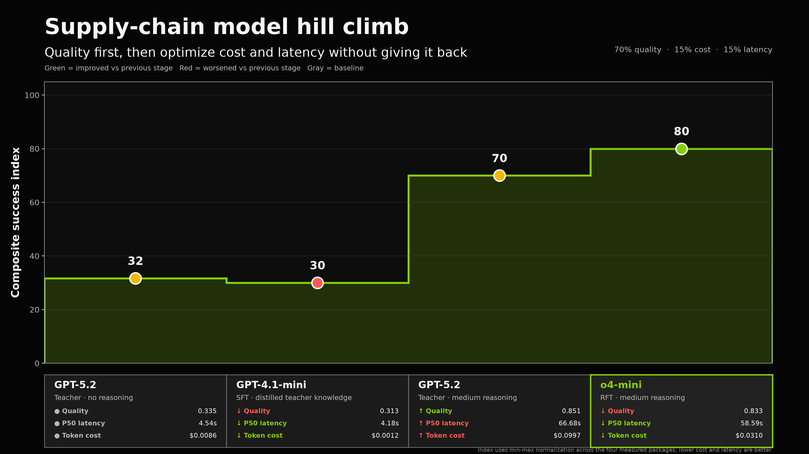

# Teacher Reasoning vs SFT vs RFT Evaluation Results

Updated on July 25, 2026 with the completed teacher-medium run. Every arm evaluated the same 150 deterministic held-out supply-chain scenarios in the same order. The original July 24 teacher run with no explicit reasoning is retained for direct comparison.

One **scenario** is one complete model request to produce a coordinated disruption-recovery plan for 12-16 orders across three warehouses (one disrupted), subject to SKU inventory, shipment capacity, delivery-time, substitution, quantity, and shared expedite-budget constraints.

## Result Summary

| Arm | Deployment | Reasoning level | Avg reasoning tokens | Quality | Feasible | Mean time/scenario | P50 / P95 latency | Token cost/scenario | Hosting cost/scenario** |
|---|---|---|---:|---:|---:|---:|---:|---:|---:|
| Teacher, previous run | `gpt-5.2` | Default / not set | 0.0 | 0.335 | 42.7% (64/150) | 4.73 s | 4.54 s / 5.59 s | $0.00858 | N/A |
| Teacher, current run | `gpt-5.2` | **Medium (explicit)** | 6,463.4 | **0.851** | 99.3% (149/150) | 82.50 s | 66.68 s / 188.69 s | $0.09975 | N/A |
| SFT | `gpt-4.1-mini-2025-04-14-sft` | Default / not set | 0.0 | 0.313 | 38.7% (58/150) | 4.14 s | 4.18 s / 4.68 s | $0.00119 | $0.00196 |
| RFT | `o4-mini-2025-04-16.ft-009235590d634c1aa8f35dcde9ecf0e6-allocat` | Medium configured* | 6,294.2 | 0.833 | **100% (150/150)** | 61.73 s | 58.59 s / 100.53 s | $0.03101 | $0.02915 |

\* The RFT fine-tuning configuration used medium reasoning, but the July 24 evaluator did not persist an explicit inference-time `reasoning_effort` field. Its 6,294 average hidden reasoning tokens confirm substantial reasoning usage. The previous teacher and SFT calls had no explicit reasoning setting and reported zero reasoning tokens.

\** Fine-tuned Global Standard deployments add `$1.70/hour` in hosting. Allocating that fee over this sequential evaluation gives `$0.00196/scenario` for SFT and `$0.02915/scenario` for RFT. Hosting accrues while idle, so production cost per scenario is `$1.70 / scenarios served per hour`, not intrinsically a latency-based request charge.

The stepped plot follows the optimization sequence from the fast, low-quality teacher baseline through SFT and the high-quality reasoning teacher to RFT. Its composite success index weights quality at 70%, inverse token cost at 15%, and inverse P50 latency at 15%; the measured component values remain visible beneath every stage.

Teacher-medium beat the previous teacher package by 0.516 quality points (paired 95% CI `[0.452, 0.578]`) and narrowly beat RFT by 0.018 points (paired 95% CI `[0.003, 0.029]`). It did so at approximately 3.2 times RFT's estimated inference cost and with higher P50 and P95 latency.

The teacher comparison is an operational package comparison, not a reasoning-only ablation: the current teacher run used both the strengthened policy prompt and explicit medium reasoning, while the previous run used the original prompt and no explicit reasoning setting.

## Original July 24 Result

The original three-arm outcome is retained below unchanged as historical evidence from before the teacher prompt and reasoning update.

| Arm | Reasoning level | Quality | Feasible | Mean time/scenario | P50 / P95 latency | Token cost/scenario | Hosting cost/scenario |
|---|---|---:|---:|---:|---:|---:|---:|
| Teacher, previous run | Default / not set | 0.335 | 42.7% (64/150) | 4.73 s | 4.54 s / 5.59 s | $0.00858 | N/A |
| SFT | Default / not set | 0.313 | 38.7% (58/150) | 4.14 s | 4.18 s / 4.68 s | $0.00119 | $0.00196 |
| RFT | Medium configured | **0.833** | **100% (150/150)** | 61.73 s | 58.59 s / 100.53 s | $0.03101 | $0.02915 |

## What Feasibility Means

Feasibility is the percentage of scenarios for which the model returned a valid, executable allocation plan. A plan is feasible only when it:

- Uses the required JSON schema and includes every order exactly once.
- Selects an available warehouse and an allowed SKU or substitute.
- Ships the exact requested quantity.
- Does not exceed inventory or warehouse shipment capacity.
- Uses a valid shipping mode and stays within the expedite budget.

Any violation makes the complete plan infeasible and gives it a quality score of zero. Feasibility does not by itself mean that a plan is commercially good: a plan that defers every order can be feasible while earning zero quality.

The previous teacher produced 64 feasible plans and SFT produced 58. RFT produced an executable plan for all 150 scenarios. The current teacher-medium run produced 149 feasible plans, with one capacity violation.

### Failure Categories

| Arm | Reasoning level | Inventory | Budget | Capacity | Schema | Quantity |
|---|---|---:|---:|---:|---:|---:|
| Teacher, previous run | Default / not set | 34 | 26 | 15 | 9 | 2 |
| Teacher, current run | Medium (explicit) | 0 | 0 | 1 | 0 | 0 |
| SFT | Default / not set | 64 | 15 | 13 | 0 | 0 |
| RFT | Medium configured | 0 | 0 | 0 | 0 | 0 |

## What Quality Means

Quality is a deterministic business-outcome score from 0 to 1:

$$
Q = 0.55S + 0.25M + 0.20C_e
$$

- $S$ is priority-weighted service: how much order priority was delivered on time.
- $M$ is retained margin, including penalties for substitution and late delivery.
- $C_e$ is fulfillment-adjusted shipping cost efficiency.

The reported quality is the mean over all 150 scenarios, including a zero for every infeasible plan. It therefore captures both the ability to obey hard constraints and the value of valid plans.

| Arm | Reasoning level | Mean service | Mean retained margin | Mean cost efficiency | Mean quality |
|---|---|---:|---:|---:|---:|
| Teacher, previous run | Default / not set | 0.372 | 0.395 | 0.161 | 0.335 |
| Teacher, current run | Medium (explicit) | **0.958** | **0.966** | **0.414** | **0.851** |
| SFT | Default / not set | 0.350 | 0.368 | 0.145 | 0.313 |
| RFT | Medium configured | 0.940 | 0.946 | 0.399 | 0.833 |

In the original July 24 comparison, RFT beat SFT by 0.520 quality points with a paired bootstrap 95% confidence interval of `[0.461, 0.580]`. In the updated comparison, teacher-medium beat RFT by 0.018 points with a paired interval of `[0.003, 0.029]`.

## Token Usage And Cost

Reasoning tokens are a subset of output tokens and are not charged a second time. Visible output is output minus reasoning.

| Arm | Reasoning level | Avg input | Avg cached input | Avg output | Avg reasoning | Avg visible output | Total tokens | Estimated run cost |
|---|---|---:|---:|---:|---:|---:|---:|---:|
| Teacher, previous run | Default / not set | 1,123.6 | 0.0 | 472.2 | 0.0 | 472.2 | 239,369 | $1.2866 |
| Teacher, current run | Medium (explicit) | 1,500.6 | 8.5 | 6,938.3 | 6,463.4 | 474.9 | 1,265,830 | $14.9623 |
| SFT | Default / not set | 1,124.6 | 6.8 | 466.8 | 0.0 | 466.8 | 238,702 | $0.1792 |
| RFT | Medium configured | 1,123.6 | 6.8 | 6,768.0 | 6,294.2 | 473.8 | 1,183,733 | $4.6514 |

RFT and teacher-medium had similar visible answer lengths and reasoning-token usage. Teacher-medium used slightly more reasoning, substantially more expensive output tokens, and a longer latency tail, accounting for its higher estimated cost and P95 latency.

### Pricing Assumptions

The estimates use Azure OpenAI Global deployment prices in USD per one million tokens available on July 24, 2026:

| Arm | Input | Cached input | Output |
|---|---:|---:|---:|
| Teacher, GPT-5.2 | $1.75 | $0.18 | $14.00 |
| SFT, GPT-4.1-mini | $0.40 | $0.10 | $1.60 |
| RFT, o4-mini | $1.10 | $0.28 | $4.40 |

These are token-based estimates; Azure billing is authoritative. Training charges and the three preliminary smoke calls are excluded. The separate hosting allocation uses the documented `$1.70/hour` fine-tuned Standard/Global Standard fee and measured mean scenario time.

## Updated Interpretation

Teacher-medium is the highest-quality package at 0.851, narrowly ahead of RFT at 0.833. RFT remains the only arm with perfect feasibility and has lower token cost and latency than teacher-medium: approximately 59 seconds P50 latency and `$0.03101` token cost per scenario versus 67 seconds and `$0.09975`. Under sequential evaluation utilization, RFT adds `$0.02915` in allocated hosting per scenario. SFT is fastest and has the lowest token and allocated hosting costs but substantially lower quality and feasibility. Production selection should therefore set explicit quality, feasibility, P95 latency, throughput, and cost requirements rather than choosing from quality alone.

## Artifacts

- [Presentation step hill-climb chart](step-hill-climb-20260725.png)
- [Previous teacher, SFT, and RFT raw report](evaluation-20260724-225229.json)
- [Current teacher-medium raw report](evaluation-20260725-130458.json)
- [Combined reasoning comparison](reasoning-hill-climb-20260725.md)
- [Evaluation methodology](../README.md)
