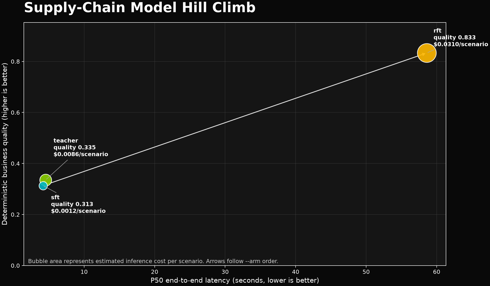

# Teacher vs SFT vs RFT Evaluation Results

Run completed on July 24, 2026. Each deployment evaluated the same 150 deterministic held-out supply-chain scenarios in the same order. The report contains fresh telemetry for all 450 model calls.

## Result Summary

| Arm | Deployment | Quality | Feasible | P50 latency | P95 latency | Estimated cost/scenario |
|---|---|---:|---:|---:|---:|---:|
| Teacher | `gpt-5.2` | 0.335 | 42.7% (64/150) | 4.54 s | 5.59 s | $0.0086 |
| SFT | `gpt-4.1-mini-2025-04-14-sft` | 0.313 | 38.7% (58/150) | 4.18 s | 4.68 s | $0.0012 |
| RFT | `o4-mini-2025-04-16.ft-009235590d634c1aa8f35dcde9ecf0e6-allocat` | **0.833** | **100% (150/150)** | 58.59 s | 100.53 s | $0.0310 |

The plot places quality on the vertical axis and P50 latency on the horizontal axis. Bubble area represents estimated inference cost per scenario. Up is better quality, left is lower latency, and a smaller bubble is lower estimated cost.

## What Feasibility Means

Feasibility is the percentage of scenarios for which the model returned a valid, executable allocation plan. A plan is feasible only when it:

- Uses the required JSON schema and includes every order exactly once.
- Selects an available warehouse and an allowed SKU or substitute.
- Ships the exact requested quantity.
- Does not exceed inventory or warehouse shipment capacity.
- Uses a valid shipping mode and stays within the expedite budget.

Any violation makes the complete plan infeasible and gives it a quality score of zero. Feasibility does not by itself mean that a plan is commercially good: a plan that defers every order can be feasible while earning zero quality.

The teacher produced 64 feasible plans and the SFT deployment produced 58. RFT produced an executable plan for every held-out scenario.

### Failure Categories

| Arm | Inventory | Budget | Capacity | Schema | Quantity |
|---|---:|---:|---:|---:|---:|
| Teacher | 34 | 26 | 15 | 9 | 2 |
| SFT | 64 | 15 | 13 | 0 | 0 |
| RFT | 0 | 0 | 0 | 0 | 0 |

## What Quality Means

Quality is a deterministic business-outcome score from 0 to 1:

$$
Q = 0.55S + 0.25M + 0.20C_e
$$

- $S$ is priority-weighted service: how much order priority was delivered on time.
- $M$ is retained margin, including penalties for substitution and late delivery.
- $C_e$ is fulfillment-adjusted shipping cost efficiency.

The reported quality is the mean over all 150 scenarios, including a zero for every infeasible plan. It therefore captures both the ability to obey hard constraints and the value of valid plans.

| Arm | Mean service | Mean retained margin | Mean cost efficiency | Mean quality |
|---|---:|---:|---:|---:|
| Teacher | 0.372 | 0.395 | 0.161 | 0.335 |
| SFT | 0.350 | 0.368 | 0.145 | 0.313 |
| RFT | **0.940** | **0.946** | **0.399** | **0.833** |

RFT beat SFT by 0.520 quality points. The paired bootstrap 95% confidence interval was `[0.461, 0.580]`, excluding zero. RFT also avoided output-pattern collapse and all-defer collapse, so it passed every preregistered RFT winner criterion.

## Token Usage And Cost

Reasoning tokens are a subset of output tokens and are not charged a second time. Visible output is output minus reasoning.

| Arm | Avg input | Avg cached input | Avg output | Avg reasoning | Avg visible output | Total tokens | Estimated run cost |
|---|---:|---:|---:|---:|---:|---:|---:|
| Teacher | 1,123.6 | 0.0 | 472.2 | 0.0 | 472.2 | 239,369 | $1.2866 |
| SFT | 1,124.6 | 6.8 | 466.8 | 0.0 | 466.8 | 238,702 | $0.1792 |
| RFT | 1,123.6 | 6.8 | 6,768.0 | 6,294.2 | 473.8 | 1,183,733 | $4.6523 |

RFT's visible answer length was similar to the other arms, but it used an average of 6,294 hidden reasoning tokens per scenario. This accounts for most of its higher latency and estimated inference cost.

### Pricing Assumptions

The estimates use Azure OpenAI Global deployment prices in USD per one million tokens available on July 24, 2026:

| Arm | Input | Cached input | Output |
|---|---:|---:|---:|
| Teacher, GPT-5.2 | $1.75 | $0.18 | $14.00 |
| SFT, GPT-4.1-mini | $0.40 | $0.10 | $1.60 |
| RFT, o4-mini | $1.10 | $1.10 | $4.40 |

The published o4-mini RFT Global table did not list a cached-input discount, so cached RFT input was conservatively priced at the normal input rate. These are token-based estimates; Azure billing is authoritative. Training charges, model-hosting charges, and the three preliminary smoke calls are excluded.

## Interpretation

RFT is the clear quality winner and the only arm with perfect feasibility. That improvement comes with a substantial operational trade-off: approximately 59 seconds P50 latency and $0.031 estimated cost per scenario, compared with roughly 4 seconds and $0.0012 for SFT. Production selection should therefore set explicit quality, P95 latency, and per-request cost requirements rather than choosing from quality alone.

## Artifacts

- [Raw evaluation report](evaluation-20260724-225229.json)
- [Hill-climb chart](hill-climb-20260724-225229.png)
- [Evaluation methodology](../README.md)
